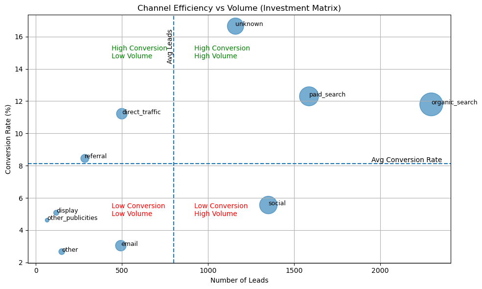
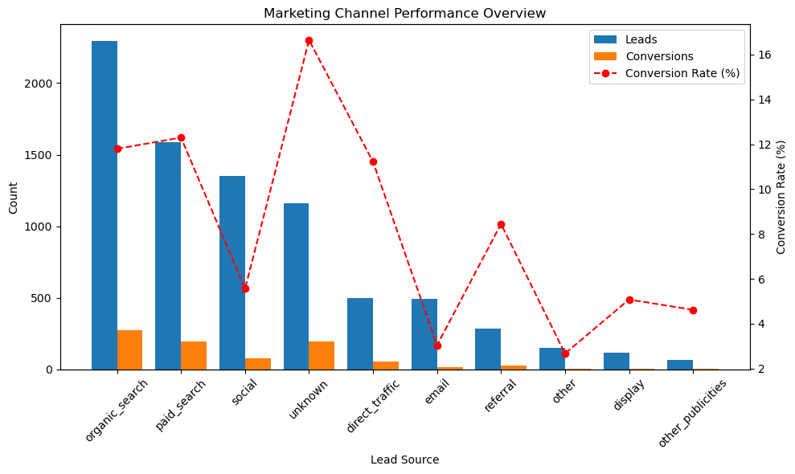
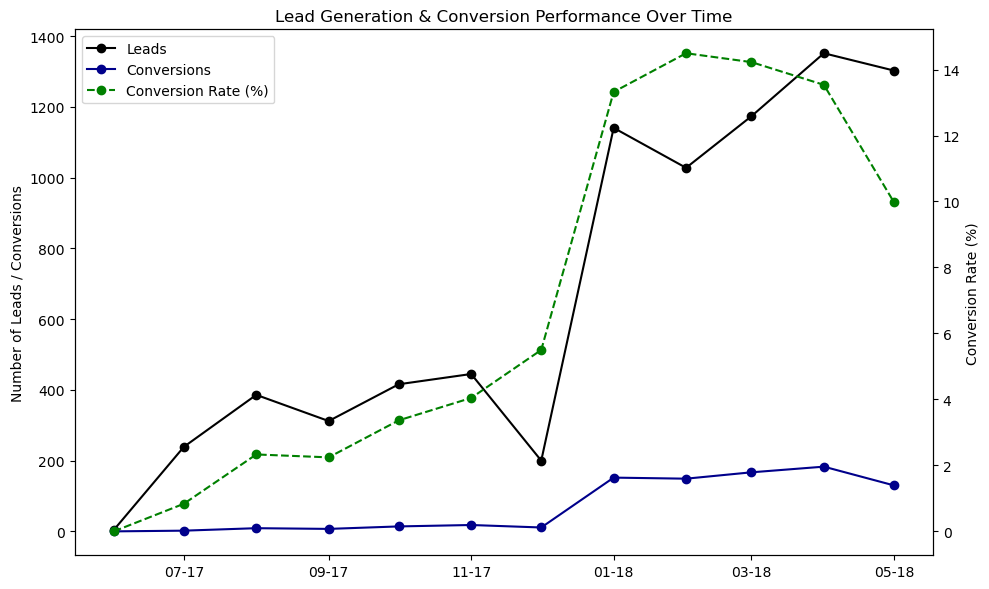
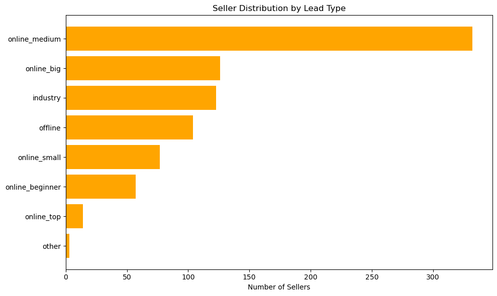
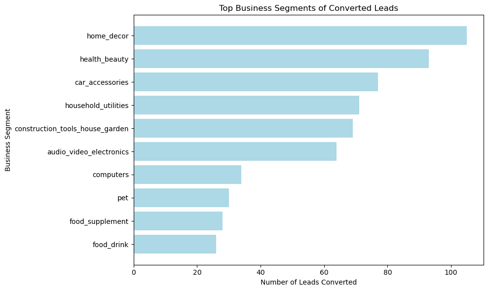

# Marketing_Analysis
Analyzing Marketing Channels Efficiency Using Python

## Executive Summary

## Project Goal

How can we improve the efficiency of our marketing strategy?

This analysis explores how marketing channels, time trends, and seller characteristics influence lead conversion and seller acquisition.

# About The Dataset

Olist is the largest department store in Brazilian marketplaces, enabling small businesses to sell products via Olist stores.

* Two datasets were combined:

Marketing Leads dataset
Contains total leads, acquisition source and first contact date.
Closed Deals dataset
Contains converted leads (sellers), business segments and seller attributes.

* By joining these datasets we analyzed:

Marketing channel performance
Seller industry composition
Conversion trends over time
# KPI Overview
* Total Leads Generated **8,000**
* Total Sellers Acquired **842**
* Overall Conversion Rate **10.53%** 
* Leads Needed per Seller **9.5** 

## Marketing Effectiveness — Key Findings

### Channel Efficiency vs Volume

### Marketing Channel Performance

* Organic Search & Paid Search = main growth engines
* Highest volume + strong conversion performance.
* Unknown channel has the highest conversion rate
* Indicates a tracking/attribution gap.
* Direct Traffic & Referral = high intent channels
* Convert well but bring lower volume.
* Social, Email & Display underperform
* Good exposure but weaker conversion efficiency.

## Time Trend Analysis — Key Findings

### Lead Generation & Conversion Funnel

* January 2018 was a turning point
* Leads, conversions and conversion rate increased significantly.
* All channels grew simultaneously
* Suggests improved marketing strategy or brand awareness.
* December shows seasonal dip
* Likely holiday season effect.

## Business Segment Insights

### Seller Distribution by Lead Type

### Top Business Segments

* Core seller industries:

Home Decor
Health & Beauty
Household & Tools
Car Accessories

* Growth vertical:

Electronics & Computers

* Emerging niches:

Pet
Food & Supplements

## Seller Profile Insights

Seller attributes are collected mostly after conversion
→ reveals a data collection gap.

Converted sellers share common characteristics
→ a clear Ideal Seller Profile (ICP) exists.
 
## Strategic Recommendations

* Scale what works

Organic Search
Paid Search
High-performing channels

* Grow high-intent acquisition

Direct Traffic
Referral

* Optimize weaker channels

Social
Email
Display

* Double down on core seller industries

Home, Beauty, Household, Tools

* Expand high-value verticals

Electronics & Technology sellers

* Improve data collection

Capture seller attributes earlier in the funnel.
